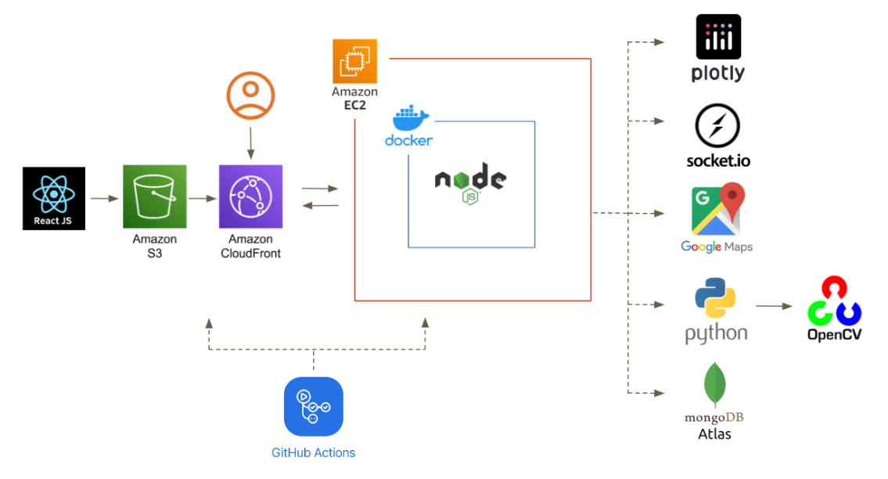

# 🧗 RockReach | 岩途

[English](#-rockreach-1) | 繁體中文

專為攀岩玩家設計的紀錄平台。上傳攀岩路線照片與影片、查看個人化數據分析、設計自訂路線，並與社群互動。

---

## 🎮 線上 Demo

👉 **https://no30131.github.io/rockreach**

> Demo 版本使用靜態假資料，無需登入即可體驗所有功能。以下是與正式版的主要差異：
>
> | 功能 | 正式版 | Demo 版 |
> |------|--------|---------|
> | 資料來源 | MongoDB Atlas（真實 API） | 靜態假資料（`fakeData.js`） |
> | 足跡地圖 | Google Maps API（需後端代理 Key） | OpenStreetMap + Leaflet（免費、免 Key） |
> | 聊天室 | Socket.IO 即時通訊 | 腳本式模擬對話 |
> | 上傳紀錄 | 寫入資料庫 + S3 圖片儲存 | 模擬送出，不寫入 |
> | 圖片 | 使用者上傳的真實照片 | [picsum.photos](https://picsum.photos) 佔位圖 |
>
> **為什麼足跡地圖換成 Leaflet？**
> 正式版透過後端 API 動態取得 Google Maps Key，避免 Key 外洩。Demo 版沒有後端，因此改用不需要 Key 的 Leaflet + OpenStreetMap，地圖功能與體驗完全一致。

---

## ✨ 功能特色

- **📁 上傳紀錄**：記錄每條攀岩路線的詳細資訊，並上傳照片與影片
- **📊 個人空間**：查看個人化數據分析、追蹤進步幅度，瀏覽所有攀岩紀錄
- **🌐 動態牆**：瀏覽所有玩家貼文、按讚、留言與分享；智慧推薦系統依用戶活躍度排序
- **🤝 好友系統**：查看好友個人頁面，透過線上聊天室即時交流
- **✏️ 自訂路線**：在個人頁面設計路線，點選岩點即自動描繪輪廓，上傳後可供分享
- **🌟 成就系統**：在指定岩館完攀特定顏色路線，解鎖收集成就
- **🗺️ 足跡地圖**：顯示造訪過的岩館地點，並追蹤會員到期日

## 🏗️ 架構



## 🛠 技術堆疊

| 層 | 技術 |
|----|------|
| 前端 | React + React Router（SPA），靜態檔案打包上傳 S3，透過 CloudFront 提供服務 |
| 後端 | Node.js + Express，RESTful API，MVC 架構，Docker 容器，部署於 EC2 |
| 資料庫 | MongoDB Atlas |
| 即時通訊 | Socket.IO 線上聊天室 |
| 圖表 | Plotly 個人化數據分析 |
| 地圖 | Google Maps API 足跡地圖 |
| 影像處理 | Python + OpenCV 岩點輪廓辨識 |
| CI/CD | GitHub Actions 自動化部署前後端 |

## 🚀 快速啟動

### 前置需求

需申請以下服務的 API Key：

| 服務 | 用途 |
|------|------|
| [Google Maps Platform](https://developers.google.com/maps) | 足跡地圖 |
| [MongoDB Atlas](https://www.mongodb.com/atlas) | 資料庫 |

### 本機開發

**後端**

```bash
cd server
npm install

# 設定環境變數
cp .env.example .env
# 填入 MONGODB_URI、PORT、ACCESS_TOKEN_SECRET、GOOGLE_MAPS_API_KEY 等

node app.js
```

**前端**

```bash
cd client
npm install
npm start
```

### 環境變數說明

在 `server/.env` 填入：

| 變數 | 說明 |
|------|------|
| `MONGODB_URI` | MongoDB Atlas 連線字串 |
| `PORT` | 伺服器埠號（預設 7000）|
| `ACCESS_TOKEN_SECRET` | JWT 簽名金鑰 |
| `GOOGLE_MAPS_API_KEY` | Google Maps API Key（Maps JS / Geocoding / Places）|

---

## 📄 License

MIT

---

## ☕ Buy me a coffee

如果這個專案對你有幫助，歡迎請我喝杯咖啡 ☕

[](https://ko-fi.com/no30131)

也歡迎訂閱我的 YouTube 頻道 🎬 [Melody's Flow | 軟體手作與日常隨筆](https://www.youtube.com/@MelodysFlow)

---

# 🧗 RockReach

[繁體中文](#-rockreach--岩途) | English

A logging platform built for climbers. Upload route photos and videos, view personalized data analytics, design custom routes, and interact with the community.

---

## 🎮 Live Demo

👉 **https://no30131.github.io/rockreach**

> The demo runs entirely on static fake data — no login required. Here's how it differs from the production version:
>
> | Feature | Production | Demo |
> |---------|------------|------|
> | Data source | MongoDB Atlas (real API) | Static fake data (`fakeData.js`) |
> | Footprint map | Google Maps API (key proxied via backend) | OpenStreetMap + Leaflet (free, no key needed) |
> | Chat room | Socket.IO real-time messaging | Scripted mock conversation |
> | Upload record | Writes to DB + S3 image storage | Simulated submit, nothing persisted |
> | Photos | User-uploaded images | [picsum.photos](https://picsum.photos) placeholders |
>
> **Why Leaflet instead of Google Maps?**
> In production, the Google Maps API key is fetched from the backend at runtime to prevent key exposure. Since the demo has no backend, the map is swapped for Leaflet + OpenStreetMap — key-free, fully open-source, and visually equivalent.

---

## ✨ Features

- **📁 Upload Records**: Log details for each climbing route and upload photos or videos
- **📊 Personal Space**: View personalized data analysis, track progress, and browse all climbing records
- **🌐 Activity Feed**: Browse all player posts, interact with likes, comments, and shares; smart recommendation system ranks posts by user activity
- **🤝 Friends**: Visit friends' personal walls and chat in real time via the online chat room
- **✏️ Custom Routes**: Design routes on your own page — click a hold to auto-draw its contour, then upload and share
- **🌟 Achievements**: Complete routes of specific colors at designated gyms to unlock achievements
- **🗺️ Footprint Map**: Visualize visited gyms on a map and track membership expiration dates

## 🏗️ Architecture


## 🛠 Tech Stack

| Layer | Technology |
|-------|------------|
| Frontend | React + React Router (SPA), Static build uploaded to S3, served via CloudFront |
| Backend | Node.js + Express, RESTful API, MVC pattern, Docker container, deployed on EC2 |
| Database | MongoDB Atlas |
| Real-time | Socket.IO chat room |
| Charts | Plotly personalized analytics |
| Maps | Google Maps API for footprint visualization |
| Image Processing | Python + OpenCV for rock hold contour recognition |
| CI/CD | GitHub Actions automated deployment for frontend and backend |

## 🚀 Quick Start

### Prerequisites

API keys required:

| Service | Purpose |
|---------|---------|
| [Google Maps Platform](https://developers.google.com/maps) | Footprint map |
| [MongoDB Atlas](https://www.mongodb.com/atlas) | Database |

### Local Development

**Backend**

```bash
cd server
npm install

# Set up environment variables
cp .env.example .env
# Fill in MONGODB_URI, PORT, ACCESS_TOKEN_SECRET, GOOGLE_MAPS_API_KEY etc.

node app.js
```

**Frontend**

```bash
cd client
npm install
npm start
```

### Environment Variables

Create `server/.env` with:

| Variable | Description |
|----------|-------------|
| `MONGODB_URI` | MongoDB Atlas connection string |
| `PORT` | Server port (default: 7000) |
| `ACCESS_TOKEN_SECRET` | JWT signing secret |
| `GOOGLE_MAPS_API_KEY` | Google Maps API Key (Maps JS / Geocoding / Places) |

---

## 📄 License

MIT

---

## ☕ Buy me a coffee

If this project has been helpful, feel free to buy me a coffee ☕

[](https://ko-fi.com/no30131)

Also check out my YouTube channel 🎬 [Melody's Flow](https://www.youtube.com/@MelodysFlow)
